# CI/CD demo pipeline on AWS

## Overview

AWS provides certain services to create a fully automated CI/CD pipeline to implement e.g. a blue/green deployment triggered by ```git push```. 

* ECS : **E**lastic **C**ontainer **S**ervice  
managed docker container environment, compatible with Fargate and EC2. We will use _Fargate_ as container launch type. By that we do not have to take care of underlying cluster resources (in contrast to use EC2 launch type).

* ECR : **E**lastic **C**ontainer **R**epository  
container repository, like e.g. DockerHub

* CodeCommit  
source code repository, basically _Git by AWS_

* CodeBuild  
CodeBuild is a fully managed continuous integration service that compiles source code, runs tests, and produces software packages that are ready to deploy.

* CodeDeploy  
CodeDeploy is a fully managed deployment service that automates software deployments to a variety of compute services such as Amazon EC2, AWS Fargate, AWS Lambda, and your on-premises servers

* CodePipeline  
CodePipeline is the orchestrator which glues together the VCS-,build- and deploy steps. Not only AWS internal services are possible, e.g. you can also integrate GitHub as VCS.


## Demo pipeline

This demo CI/CD pipeline will

* run container on _AWS ECS_ cluster
* fetch the container from _AWS ECR_
* store the container implementation within _CodeCommit_
* use _CodeBuild_ to build the container and push it to _ECR_
* use _CodeDeploy_ to deploy updated container to _ECS_ cluster, replacing the "old" container

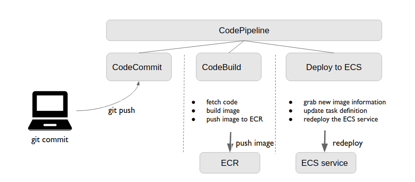

To keep the infrastructure somehow simple, the whole setup uses a VPC with only 2 public subnets (in 2 different AZs) to show HA across availability zones.

## Setup

The creation of the following resources is automated via terraform:
* vpc
* subnets (2 public)
* security groups
* loadbalancer (ALB)
* ECS cluster
* ECR (container) repository
* CodeCommit (code) repository

After those resources are up, the remaining steps are:
* push the code to CodeCommit repository
* create the CI/CD pipeline

### automated creation of resources via terraform

**prerequisites** : 
* aws cli installed and configured (by default terraform takes the AWS_ACCESS_KEY and AWS_SECRET_KEY from ~/.aws/credentials , from the profile _default_ )
  * the user you configured needs to have proper permissions to create the resources 
* terraform installed v0.12+  ==> [instructions](https://learn.hashicorp.com/terraform/getting-started/install.html)
* to execute the **terratest** IaC tests you need to have _golang_ installed. It uses the built-in package _testing_  to run ```go test xyz_test.go``` ( details of Terratest [here](https://terratest.gruntwork.io/docs/#getting-started))

#### create S3 bucket and dynamoDB table

```bash
cd terraform/terraform-s3-remote-state
#run once
terraform init
#check your terraform code
terraform validate
terraform plan
#deploy
terraform apply
```

#### create core AWS resources

run the tests upfront

```bash
cd <repo-root-dir>/terraform/core-aws/terratest
go test terraform-core-aws_test.go
# for verbose output add flag -v
# go test -v terraform-core-aws_test.go
```

and then create the resources

```bash
cd <repo-root-dir>/terraform/core-aws
#run once
terraform init
#check your terraform code
terraform validate
terraform plan
#deploy
terraform apply
```

#### create ECS related resources

```bash
cd <repo-root-dir>/terraform/services/ecs
#run once
terraform init
#check your terraform code
terraform validate
terraform plan
#deploy
terraform apply
```

#### create CICD related resources

```bash
cd <repo-root-dir>/terraform/services/cicd
#run once
terraform init
#check your terraform code
terraform validate
terraform plan
#deploy
terraform apply
```

### CodeCommit

*prerequisite*: you have _Git_ installed  

#### Preparation

[official AWS docu](https://docs.aws.amazon.com/codecommit/latest/userguide/setting-up-gc.html)

attach the predefined policies **_AWSCodeCommitPowerUser_** to your IAM user

#### setup CodeCommit

1. grab the sourcecode
```
git clone git@github.com:gkoenig/go-simplehttp.git
```
2. setup ssh and clone CodeCommit repo
get instructions from the CodeCommit repo page [here](https://eu-central-1.console.aws.amazon.com/codesuite/codecommit/repositories/aws-cicd-demo-code-repo/setup?region=eu-central-1) , and how to setup ssh [ħere](https://docs.aws.amazon.com/codecommit/latest/userguide/setting-up-ssh-unixes.html?icmpid=docs_acc_console_connect_np)
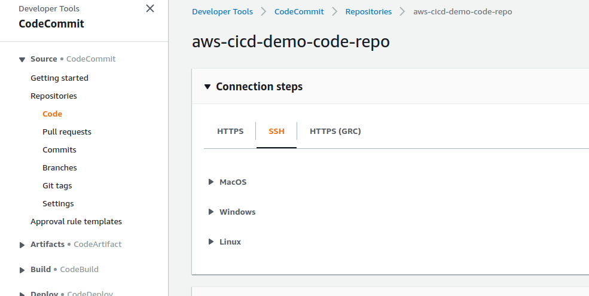  
```
git clone ssh://git-codecommit.eu-central-1.amazonaws.com/v1/repos/aws-cicd-demo-code-repo 
```
3. add code to CodeCommit repo
```
cp ./go-simplehttp/Dockerfile ./go-simplehttp/simpleHTTP.go ./aws-cicd-demo-code-repo
cp ./scripts/buildspec.yml ./aws-cicd-demo-code-repo
cd aws-cicd-demo-code-repo/
git add .
git commit -m "Initial commit"
git push
```
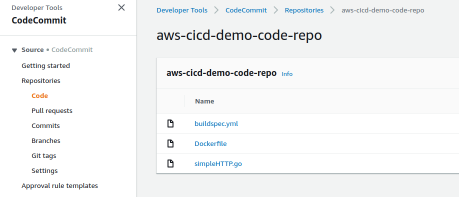
4. 

### CodeBuild

Configre a _CodeBuild_ project which builds a new container image and pushes it to ECR, triggered by a code change in our _CodeCommit_ repository.

#### IAM permissions

Create a dedicated role for CodeBuild. It will assume that role with its certain permissions, especially in our case permissions for ECR.

In IAM section of AWS console

* click _Policies_
* click _create Policy_ ==> choose **JSON**
* paste the following JSON as policy content
```
{
  "Version": "2012-10-17",
  "Statement": [
    {
      "Sid": "CloudWatchLogsPolicy",
      "Effect": "Allow",
      "Action": [
        "logs:CreateLogGroup",
        "logs:CreateLogStream",
        "logs:PutLogEvents"
      ],
      "Resource": [
        "*"
      ]
    },
    {
      "Sid": "CodeCommitPolicy",
      "Effect": "Allow",
      "Action": [
        "codecommit:GitPull"
      ],
      "Resource": [
        "*"
      ]
    },
    {
      "Sid": "S3GetObjectPolicy",
      "Effect": "Allow",
      "Action": [
        "s3:GetObject",
        "s3:GetObjectVersion"
      ],
      "Resource": [
        "*"
      ]
    },
    {
      "Sid": "S3PutObjectPolicy",
      "Effect": "Allow",
      "Action": [
        "s3:PutObject"
      ],
      "Resource": [
        "*"
      ]
    },
    {
      "Sid": "ECRPullPolicy",
      "Effect": "Allow",
      "Action": [
        "ecr:BatchCheckLayerAvailability",
        "ecr:GetDownloadUrlForLayer",
        "ecr:BatchGetImage"
      ],
      "Resource": [
        "*"
      ]
    },
    {
      "Sid": "ECRAuthPolicy",
      "Effect": "Allow",
      "Action": [
        "ecr:GetAuthorizationToken"
      ],
      "Resource": [
        "*"
      ]
    },
    {
      "Sid": "S3BucketIdentity",
      "Effect": "Allow",
      "Action": [
        "s3:GetBucketAcl",
        "s3:GetBucketLocation"
      ],
      "Resource": 
        "*"
    }
  ]
}
```

* set **CodeBuildServiceRolePolicy** as policy name
* in the main navigation choose _Roles_
* click _create Role_
* choose **CodeBuild** as AWS service to add and click _Next::Permissions_
* on _attach permissions policies_ page, select **CodeBuildServiceRolePolicy** and **AmazonEC2ContainerRegistryPowerUser** to add
* save the role as **CodeBuildServiceRole**

#### CodeBuild project

* open CodeBuild service page within AWS mgm console [Link](https://eu-central-1.console.aws.amazon.com/codesuite/codebuild/projects?region=eu-central-1)
* click **Create build project**
* set the _Project Name_  
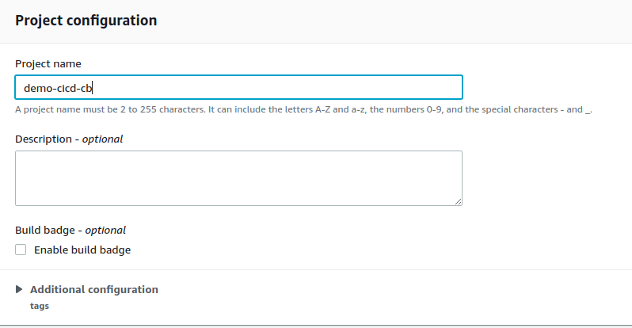

* configure the _Source provider_ by linking it to our CodeCommit repository, master branch  
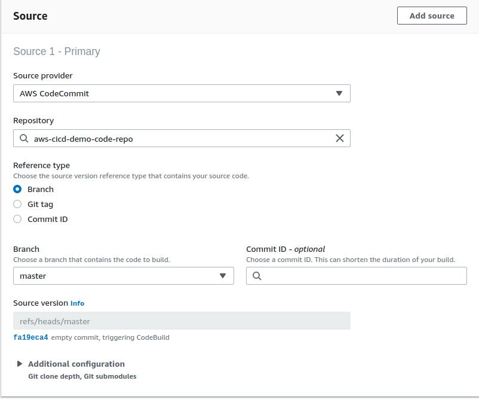

* configure the build environment
  * use the AmazonLinux2 as base
  * use always the latest image of it
  * check the _privileged_ flag
  * choose **Existing service role** and select the one we created in the previous step (_CodeBuildServiceRole_)
  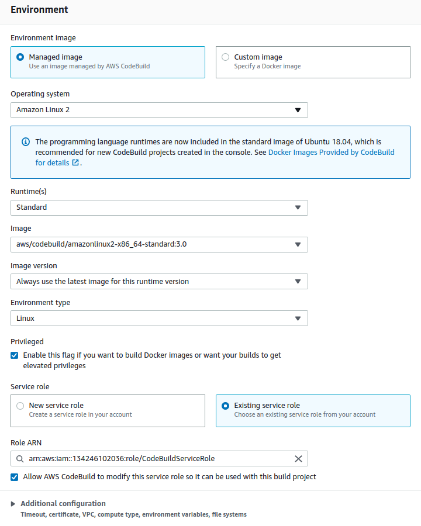

* set buildspec  
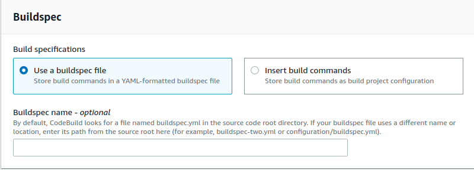

* keep default settings for sections **Artifacts** and **Logs**  


* click **Create build project**

#### manually trigger a codebuild run

* in the _Build projects_ overview click on the previously created project **demo-cicd-cb**
* click on **Start build** in top right corner
* keep settings, scroll down and click **Start build**
* observe the build log output ...

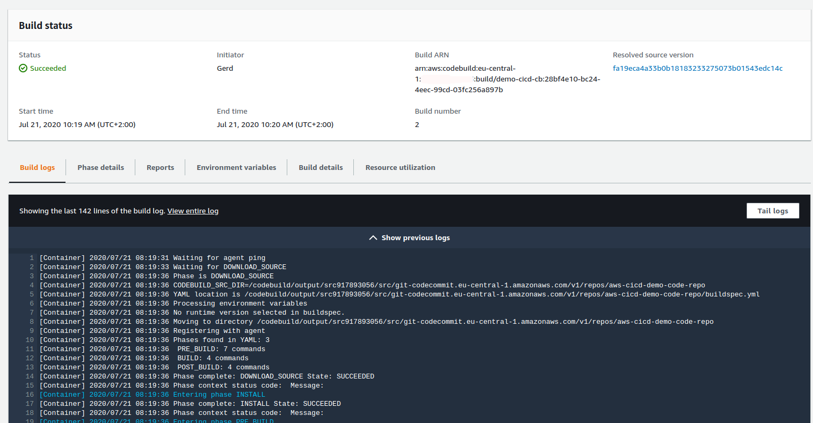

After a successfull build you'll find your new image listed in the [ECR repository](https://eu-central-1.console.aws.amazon.com/ecr/repositories?region=eu-central-1)

### CodePipeline

* Open the **CodePipeline** page [ħere](https://eu-central-1.console.aws.amazon.com/codesuite/codepipeline/pipelines?region=eu-central-1)
* click **Create pipeline** in the top right corner
* configure _Pipeline settings_
  * provide pipeline name: _demo-pipeline_
  * let the wizard create a _Service role_ for us, with the suggested _Role name_
  * in the advanced settings, keep the default S3 location and KMS Key  
  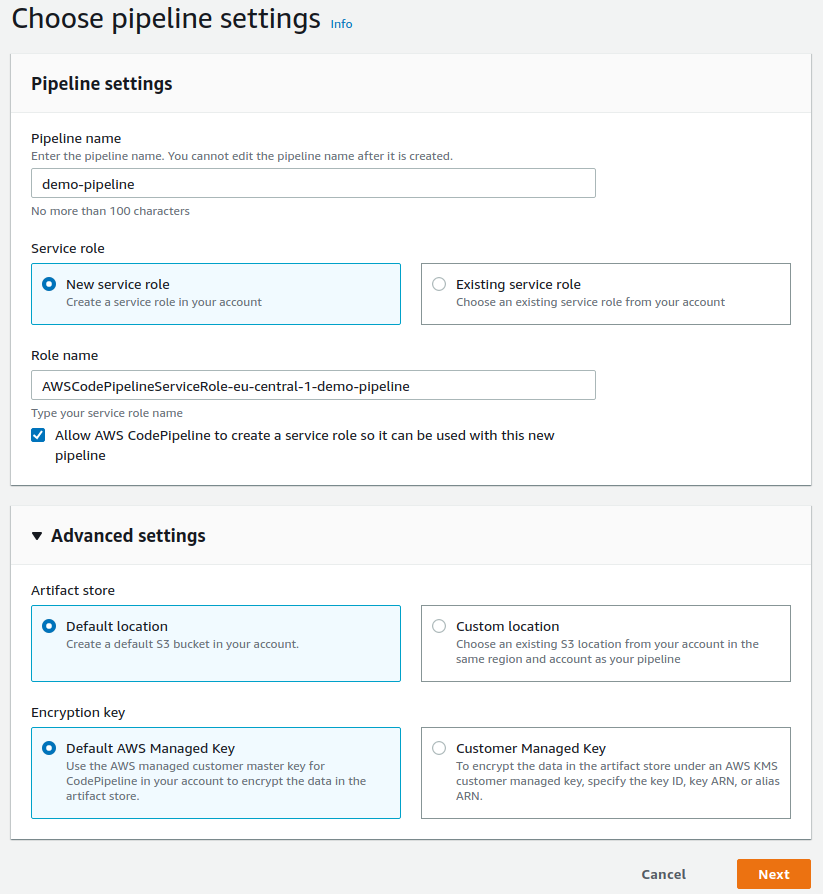  
  * click **Next**  
* configure _Source stage_
  * choose _CodeCommit_ as source provider and the _master_ branch of our repository
  * let _CloudWatch_ trigger our pipeline (default setting)  
  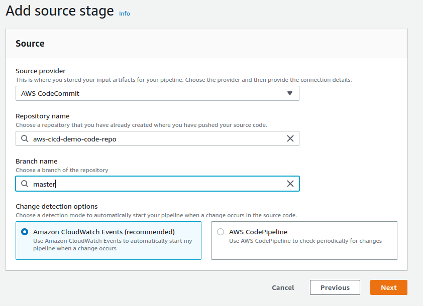  
  * click **Next** 
* configure _Build stage_
  * select _CodeBuild_ as provider
  * choose our previously create CodeBuild project within eu-central-1 region (Frankfurt)
  * click **Next**  
  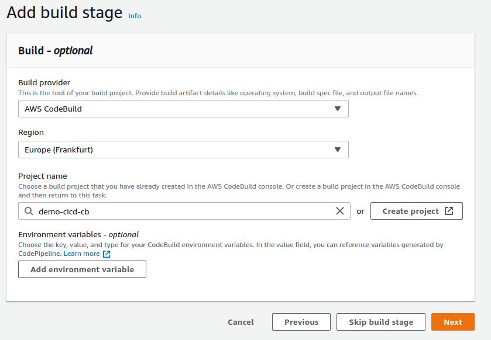
* configure _Deploy stage_
  * select _Amazon ECS_ as provider
  * choose our region, ECS cluster and ECS service
  * specify the image definitions file as we called it in the buildspec: _imagedefinitions.json_
  * click **Next**  
  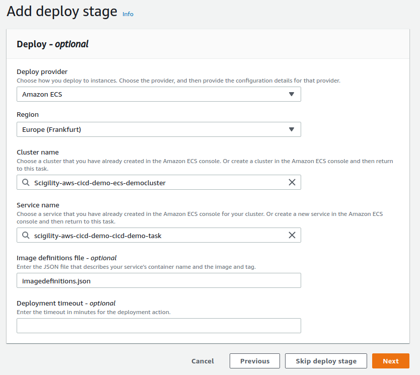
* on the _Review_ page scroll down and click **Create pipeline**  

> the pipeline will start immediately !!

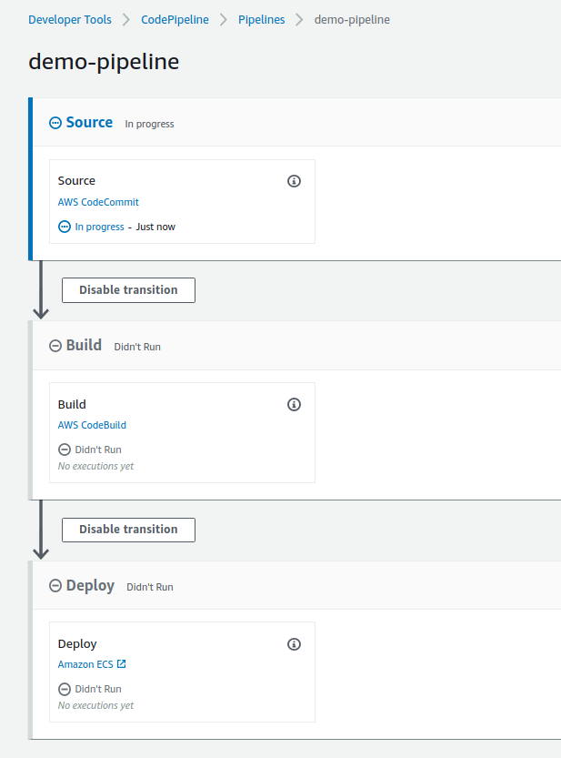

You can ovserve the details of each phase by clicking on the _Details_ link. E.g. for the build phase you'll be forwarded to the build log as we have seen in the _CodeBuild_ chapter.

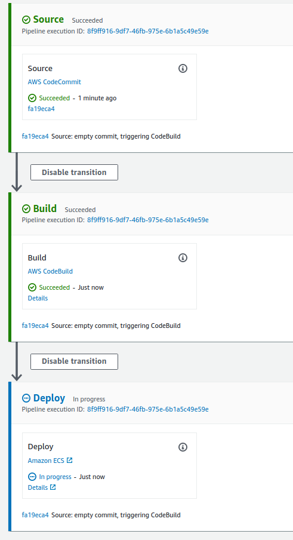

> 
> keep in mind that the _deploy_ phase will take at least 5 minutes, because it waits for the old task(s) to be stopped. This, by default, will take roughly 5 minutes.
> you can observe this in the ECS service overview, clicking on the tab _Events_
> 
> 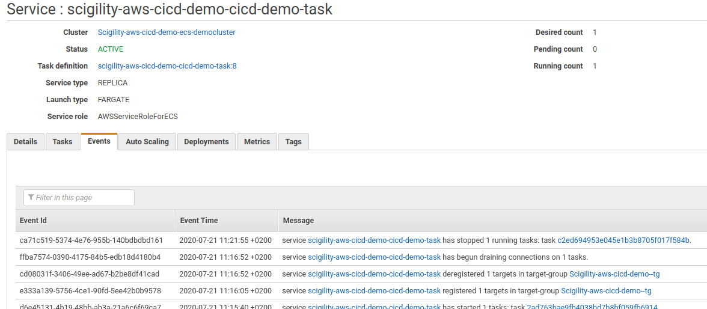